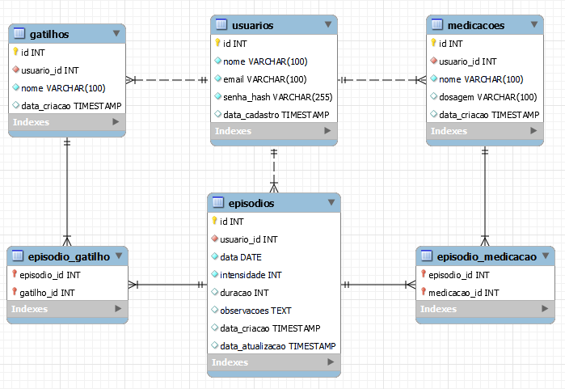

# Banco de Dados – Diário da Enxaqueca

O backend utiliza **MySQL** como banco de dados.  
O script de inicialização se encontra em [`backend/mysql-init/init.sql`](https://github.com/diario-enxaqueca/backend/blob/main/mysql-init/init.sql) e cria as tabelas necessárias para o funcionamento do sistema.

## Estrutura do Banco de Dados

O script define as seguintes tabelas:

- **usuario**: informações de login e identificação de cada usuário.  
- **episodios**: registro dos episódios de enxaqueca de um usuário.  
- **gatilhos**: possíveis gatilhos relacionados a um episódio.  
- **medicacoes**: medicamentos usados em cada episódio.  
- **episodio_gatilho**: gatilhos associados a determinado episódio.
- **episodio_medicacao**: medicamentos associados a determinados episódios.

## Diagrama do Esquema Físico

Abaixo está a representação visual do DDL:

> **Observação:**  
> - Cada **usuário** pode ter vários **episódios**.  
> - Cada **episódio** pode estar relacionado a múltiplos **gatilhos** e múltiplas **medicações**.  
> - Cada **episódio** só pode estar relacionado a um **usuário**.
