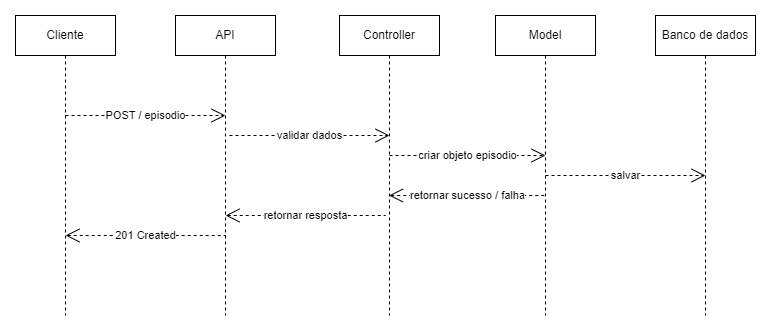

# Diagrama de Sequência – Registrar episódio de enxaqueca

Este documento apresenta o **diagrama de sequência** do fluxo **Registrar episódio de enxaqueca** no sistema **Diário de Enxaqueca**, detalhando a interação entre o cliente, API, controller, model e banco de dados.

---

## Diagrama (ASCII)

---

## Explicação do Fluxo

1. **Cliente**

   * Envia uma requisição HTTP `POST /episodio` com os dados da nova episódio de enxaqueca.

2. **API (FastAPI)**

   * Recebe a requisição do cliente.
   * Valida os dados obrigatórios (`data` e `intensidade`) e verifica formato correto.

3. **Controller**

   * Cria o objeto `Entrada` com os dados recebidos.
   * Chama o método do **Model** para persistência.

4. **Model (SQLAlchemy)**

   * Executa a operação de persistência (`save()`) no banco de dados.

5. **Banco de Dados**

   * Insere o episódio na tabela correspondente (`e`).

6. **Retorno**

   * O Model retorna o resultado da operação para o Controller.
   * O Controller envia a resposta da API para o cliente:

     * **201 Created** em caso de sucesso
     * Mensagem de erro adequada em caso de falha

---

### Observações

* Este fluxo ilustra o **CRUD “Registrar episódio de enxaqueca”**, mas a lógica é similar para **Editar**, **Visualizar** e **Deletar**.
* Segue o padrão **MVC**, separando responsabilidades entre API, Controller e Model.
* Serve como base para implementação de testes e documentação do backend.
