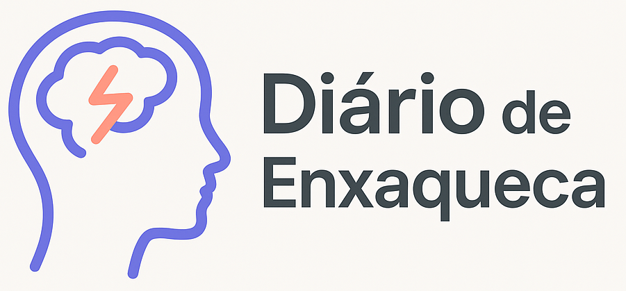
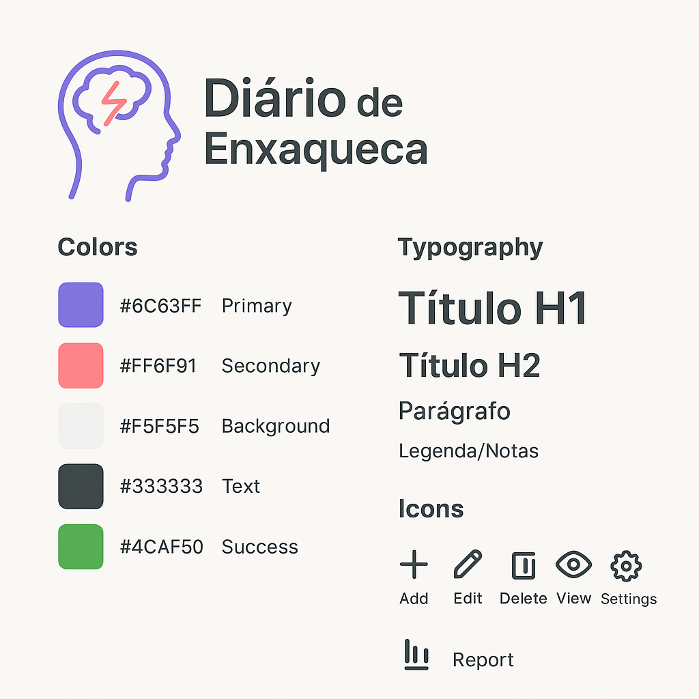

# Guia de Estilo – Diário de Enxaqueca

## Logo e Identidade Visual

Logo oficial:  

Ícone (versão simplificada):  

---

## Guia de estilo

Logo oficial:  

---

### Paleta de Cores

Primária (Roxo Suave): #6C63FF

Secundária (Rosa Claro): #FF6F91

Cinza Claro (Background): #F5F5F5

Cinza Escuro (Texto): #333333

Verde Suave (Feedback/Êxito): #4CAF50

#### Contraste WCAG (Diretrizes de Acessibilidade para Conteúdo Web)

Texto escuro (#333333) sobre fundo claro (#F5F5F5) → contraste 12.6:1 (AAA).

Roxo (#6C63FF) sobre branco (#FFFFFF) → contraste 5.8:1 (AA).

Rosa (#FF6F91) sobre branco (#FFFFFF) → contraste 4.9:1 (AA).

---

###  Tipografia

Fonte primária: Inter (Google Fonts).

Fallbacks: Arial, sans-serif.

#### Tamanhos base:

Título H1: 28px / 700 (negrito).

Título H2: 22px / 600.

Parágrafo: 16px / 400.

Legenda/Notas: 12px / 400.

---

## Ícones Autoexplicativos

➕ Add (Adicionar)

✏️ Edit (Editar)

🗑️ Delete (Excluir)

👁️ View (Visualizar)

⚙️ Settings (Configurações)

📅 Calendar (Data da crise)

📊 Report (Relatório de crises)

