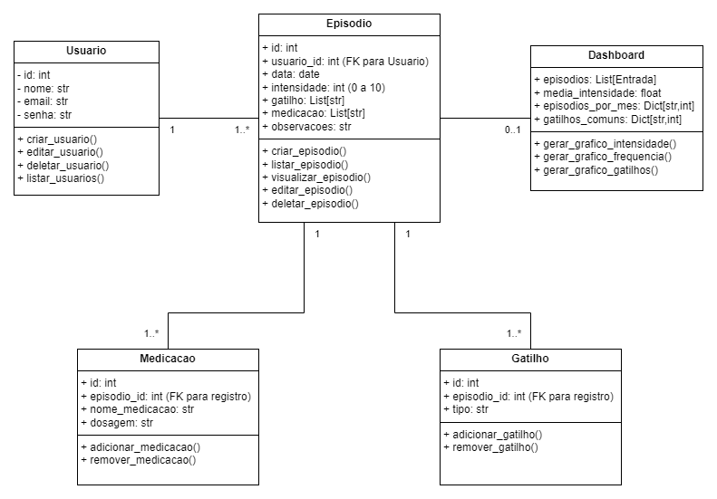

# Diagrama de Classes – Diário de Enxaqueca

Este documento apresenta o **diagrama de classes** do projeto **Diário de Enxaqueca**, mostrando as entidades principais, atributos, métodos e suas relações.

---

## Diagrama

---

## Explicação do Diagrama

### 1. Usuario

* Representa os usuários do sistema.
* **Atributos principais:** `id`, `nome`, `email` e `senha`.
* **Métodos:** CRUD de usuários (`criar_usuario`, `editar_usuario`, `deletar_usuario`, `listar_usuarios`).
* **Relação:** cada usuário pode ter vários episódios de enxaqueca (1 → N).

### 2. Entrada

* Entidade central do sistema, representa um episódio de enxaqueca.
* **Atributos:** `id`, `usuario_id` (FK), `data`, `intensidade`, `gatilhos`, `medicacoes` e `observacoes`.
* **Métodos:** CRUD de episódios (`criar_episodio`, `listar_episodio`, `visualizar_episodio`, `editar_episodio`, `deletar_episodio`).
* **Relação:** cada episódio pertence a um único usuário e pode ter vários gatilhos e medicações (1 → N).

### 3. Gatilho

* Representa os gatilhos associados a um episódio de enxaqueca.
* **Atributos:** `id`, `episodio_id` (FK), `tipo`.
* **Métodos:** `adicionar_gatilho`, `remover_gatilho`.
* **Relação:** cada episódio pode ter vários gatilhos (1 → N).

### 4. Medicacao

* Representa as medicações associadas a um episódio.
* **Atributos:** `id`, `episodio_id` (FK), `nome_medicacao`, `dosagem`.
* **Métodos:** `adicionar_medicacao`, `remover_medicacao`.
* **Relação:** cada episódio pode ter várias medicações (1 → N).

### 5. Dashboard

* Agrega dados de vários episódios para apresentar estatísticas e gráficos.
* **Atributos:** lista de episódios, média de intensidade, episódios por mês, gatilhos mais comuns.
* **Métodos:** `gerar_grafico_intensidade`, `gerar_grafico_frequencia`, `gerar_grafico_gatilhos`.
* **Relação:** depende de vários episódios (agregação), mas não possui FK direta.

---

## Observações Gerais

* O diagrama segue o padrão **MVC**, refletindo a estrutura do backend.
* Classes e métodos estão alinhados ao **MVP completo** do projeto.
* Facilita a compreensão do sistema e serve como base para implementação e testes.

