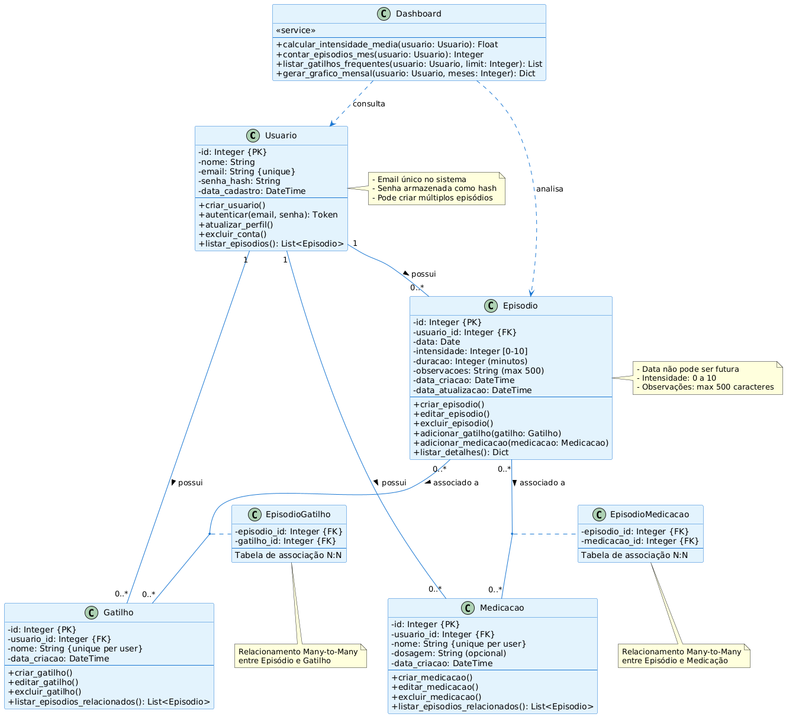

# 📐 Diagramas UML — Diário de Enxaqueca

Este diretório contém os diagramas UML do projeto.

---

## Diagrama de Classes

**Descrição:** Representa todas as entidades do sistema (Usuario, Episodio, Gatilho, Medicacao) e seus relacionamentos.

**Arquivo fonte:** [diagrama-classes.puml](./diagrama-classes.puml)

---

## Diagramas de Sequência

### 1. Criar Episódio

**Descrição:** Fluxo completo de criação de um episódio de enxaqueca, desde o frontend até persistência no banco.

**Arquivo fonte:** [sequencia-criar-episodio.puml](./sequencia-criar-episodio.puml)

---

### 2. Login de Usuário

**Descrição:** Processo de autenticação com validação de credenciais e geração de token JWT.

**Arquivo fonte:** [sequencia-login.puml](./sequencia-login.puml)

---

### 3. Listar Episódios

**Descrição:** Listagem de episódios com aplicação de filtros e carregamento de relações.

**Arquivo fonte:** [sequencia-listar-episodios.puml](./sequencia-listar-episodios.puml)

---

## Como Atualizar os Diagramas

1. Edite o arquivo `.puml` correspondente
2. Regenere a imagem usando PlantUML
3. Atualize a imagem PNG/SVG no repositório
4. Commit e push das alterações

---

## Ferramentas Recomendadas

- **VS Code + PlantUML Extension**
- **PlantUML Online Editor:** [plantuml.com](https://www.plantuml.com/plantuml/uml/)
- **CLI:** `plantuml diagrama.puml`
